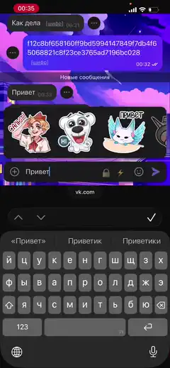
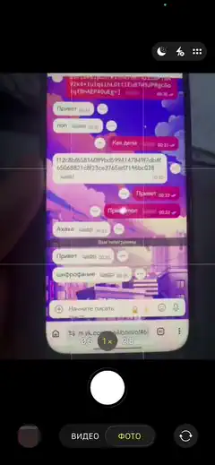

# VKEncrypt

Шифрует сообщения в ВКонтакте. Установка — 5 секунд.

&nbsp;&nbsp;

## Установка

### Компьютер — Tampermonkey

1. Установите расширение [Tampermonkey](https://chromewebstore.google.com/detail/tampermonkey/dhdgffkkebhmkfjojejmpbldmpobfkfo) в свой браузер (Chrome / Firefox / Edge / Brave).
2. Нажмите **[Установить VKEncrypt](https://raw.githubusercontent.com/megamen32/vkencrypt/master/extension/vkencrypt.user.js)** — Tampermonkey сам откроет окно установки. Жмите «Установить».
3. Откройте `vk.com`, `vk.ru` или `web.vk.me` и зайдите в любой чат.

### iPhone — Safari

1. Установите бесплатное приложение [Userscripts](https://apps.apple.com/app/userscripts/id1463296397) из App Store.
2. Откройте **Настройки iOS → Safari → Расширения → Userscripts** и включите расширение. 
3. Откройте в safari: **[Установить VKEncrypt](https://raw.githubusercontent.com/megamen32/vkencrypt/master/extension/vkencrypt.user.js)**. Нажмите слева от адрессной строки на меню, в меню нажмите "Userscripts", в Userscripts наверху нажмите "Tap to install".  
4. Откройте `vk.com`, `vk.ru` или `web.vk.me` в Safari и зайдите в любой чат.

### Android — Firefox Browser

Firefox — мобильный браузер, который поддерживает полноценные расширения.

1. Установите **[Firefox Browser](https://play.google.com/store/apps/details?id=org.mozilla.firefox&hl=ru)** из Google Play.
2. Внутри Firefox установите **[Tampermonkey](https://addons.mozilla.org/ru/firefox/addon/tampermonkey/)**.
3. Нажмите **[Установить VKEncrypt](https://raw.githubusercontent.com/megamen32/vkencrypt/master/extension/vkencrypt.user.js)** — Tampermonkey предложит установку.
4. Откройте `vk.com`, `vk.ru` или `web.vk.me` и зайдите в любой чат.

## Как пользоваться

При первом открытии чата в поле ввода появятся две иконки:

- **🔒** — зашифровать набранное сообщение. Если ключей ещё нет — откроется окно настройки.
- **🔑** — меню ключей, настроек и seed-фразы.

Введи секретную фразу (≥ 6 символов, лучше длиннее) — скрипт детерминированно сгенерирует ключи `k1..k4` и сохранит их. Собеседник с той же фразой получит те же ключи. Можно также добавлять свои 64-hex ключи через меню.

Опционально: **автошифрование** (в меню 🔑) — тогда Enter сам шифрует и отправляет, а ручной 🔒 прячется. Shift+Enter остаётся переносом строки.

## Подробности

- Как устроено шифрование, как менять ключи, формат шифра, безопасность — в [TECHNICAL.md](TECHNICAL.md).
- Установка VK-бота (опционально, если хотите перенести своего тг бота в вк) — в [bot/README.md](bot/README.md).
- Детали по расширению для разработчиков — в [extension/README.md](extension/README.md).

## Лицензия

[MIT](LICENSE)
